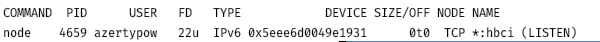

## run app

sur all dependencies are installed

```npm install```

run server

```npm run server```

open url ```http://localhost:3000/app``` on chrome

## install

### install dependencies

```
npm install
```

### run dev mode

```
npm run dev
```

## error

### if error message in terminal, see if port are used

```
lsof -i:3000
lsof -i:1234
```

if commande lines return this message


use command "kill" with PID (for example 4659)

```
kill 4659
```

## important chrome settings

prevent gesture necessity for auto play audio media

```
chrome://flags/#autoplay-policy
``` 